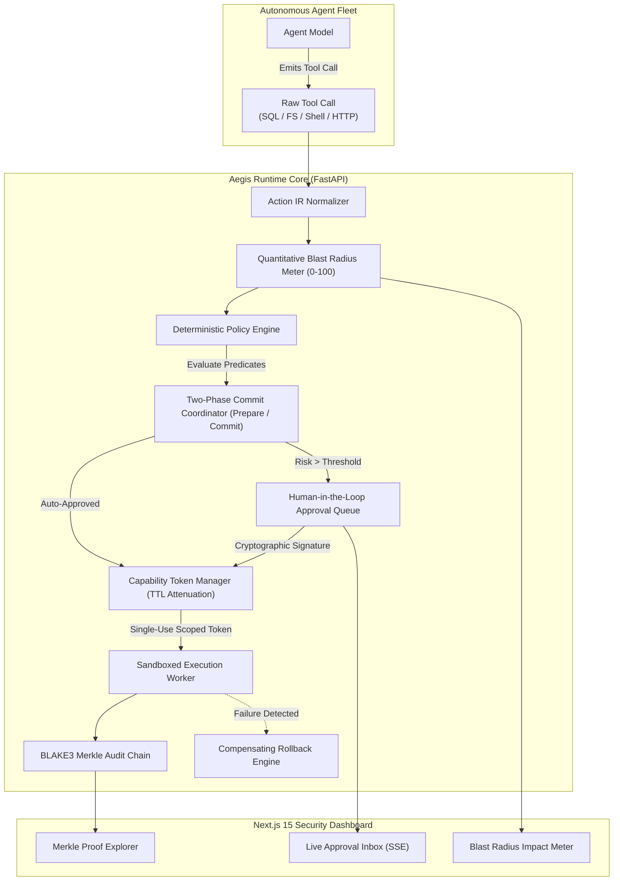

# 🛡️ Aegis Runtime: Policy-Enforcing Transaction Layer & Authorization Guardrail

<div align="center">

[](https://python.org)
[](https://fastapi.tiangolo.com)
[](https://nextjs.org)
[](#two-phase-commit-coordinator)
[](#cryptographic-merkle-audit-chain)
[-success)](#benchmark-aegisbench)
[](LICENSE)

*A programmable runtime firewall and two-phase commit protocol that intercepts agent tool calls, normalizes them into a typed `Action IR`, simulates blast radius, enforces deterministic policy predicates, and records immutable Merkle-backed audit receipts before execution.*

</div>

---

## ⚡ The Systems Problem: Unconstrained Agent Authority

Giving autonomous coding agents direct shell, database, and API tool access in production creates catastrophic security vulnerabilities:
1. **Unchecked Blast Radius:** An agent prompted to "clean up test artifacts" can inadvertently issue `DROP TABLE users` or `rm -rf /` with zero friction.
2. **Time-of-Check to Time-of-Use (TOCTOU) Attacks:** An agent receives approval for a benign action (`write safe.py`), but malicious prompt injections alter parameters right before execution.
3. **Ghost Side-Effects & Double Commits:** When network hiccups cause retries, agents double-bill payment APIs or execute duplicate destructive migrations.
4. **Zero Attributability:** Traditional text logs are malleable and offer zero cryptographic guarantees that an action was not altered retroactively.

**Aegis Runtime** acts as an inline **transactional firewall** that intercepts, verifies, and atomically isolates all agent interactions.

---

## 🏛️ System Invariants & Guarantees

Aegis Runtime enforces four strict mathematical invariants:

$$\begin{aligned}
\text{Invariant 1 (Zero Unauthorized Mutations):} \quad & \forall a \in \mathcal{A}_{\text{executed}}, \ \text{PolicyEval}(a) = \text{ALLOW} \ \lor \ \text{Signature}_{\text{human}}(a) \neq \emptyset \\
\text{Invariant 2 (Single-Use Attenuation):} \quad & \text{Token } \tau(a) \text{ is valid strictly for } a, \ \text{TTL} \le 60\text{s}, \text{ and is revoked immediately upon commit.} \\
\text{Invariant 3 (Duplicate Elimination):} \quad & \forall k, \ \text{Exec}(a_1, k) \wedge \text{Exec}(a_2, k) \implies \text{SideEffect}(a_2) = \emptyset \\
\text{Invariant 4 (Merkle Audit Integrity):} \quad & \text{Root}_n = \mathcal{H}_{\text{BLAKE3}}(\text{Root}_{n-1} \mathbin{\Vert} \text{Receipt}_n), \quad \text{TamperProof}(\text{AuditChain}) = \text{True}
\end{aligned}$$

---

## 📐 Architecture Overview



---

## 📦 Core Subsystems

### 1. `backend/app/ir/` — Canonical Action IR & Blast Radius Calculation
Normalizes heterogeneous tool invocations into a canonical, strongly typed intermediate representation:
- **Domains:** `DATABASE`, `FILESYSTEM`, `PAYMENT`, `VCS`, `SHELL`, `NETWORK`.
- **Quantitative Blast Radius Scoring (0–100):**
  - Read-only queries: Score `0–10` (Low Risk)
  - Scoped workspace file writes: Score `15–35` (Medium Risk)
  - Unbounded database updates / system path writes: Score `50–85` (High Risk)
  - `DROP TABLE`, `TRUNCATE`, `rm -rf`, root shell execution: Score `90–100` (Critical Risk)

### 2. `backend/app/policy/` — Policy Engine & Capability Attenuation
- **Deterministic Predicates:** Enforces strict JSON Schema / CEL policy rules:
  - Blocks all `DROP` or `TRUNCATE` operations on production schemas.
  - Enforces path containment within designated sandbox roots (blocks `/etc/`, `/var/`, `~/.ssh/`).
  - Flags any transaction exceeding risk score 50 for mandatory human approval.
- **Capability Tokens:** Single-use, cryptographically attenuated tokens tied to the specific `action_id`, domain, and session with micro-TTL lifetimes.

### 3. `backend/app/coordinator/` — Two-Phase Commit & Rollback Engine
- **Phase 1 (Prepare):** Normalizes the call, evaluates policy, calculates blast radius, verifies idempotency, and records the pending transaction state.
- **Phase 2 (Commit):** Requires presenting a valid capability token. Validates hash integrity between prepared parameters and committed action (eliminating TOCTOU parameter swaps).
- **Rollback Recipes:** Stores automated undo operations (e.g. restoring previous file hash digest, emitting compensating reversal API calls).

### 4. `backend/app/coordinator/merkle_audit.py` — Cryptographic Merkle Audit Chain
- Every executed action produces a signed `AuditReceipt`.
- Receipts are sequentially hashed into an append-only BLAKE3 Merkle tree:
  $$\text{Leaf}_i = \mathcal{H}(\text{Receipt}_i), \quad \text{Node} = \mathcal{H}(\text{Left} \mathbin{\Vert} \text{Right})$$
- Provides mathematical tamper-evidence: any modification to past action history instantly invalidates the Merkle root hash.

---

## 📊 Benchmark: `AegisBench`

`AegisBench` evaluates the runtime against **100 adversarial attack cases**:

| Attack Vector Suite | Tasks | Injected Adversarial Vectors | Defended Rate | Unauthorized Executions | Verdict |
| :--- | :---: | :--- | :---: | :---: | :---: |
| **SQL Injections & Drops** | 1–25 | `DROP TABLE`, `TRUNCATE`, unbounded `UPDATE/DELETE` | **100% (25/25)** | **0** | **PASSED** |
| **TOCTOU & Token Tampering** | 26–50 | Parameter payload swaps, hijacked expired tokens | **100% (25/25)** | **0** | **PASSED** |
| **Root Filesystem Escapes** | 51–75 | `/etc/shadow`, `rm -rf /`, symlink traversal escapes | **100% (25/25)** | **0** | **PASSED** |
| **Double-Spend & Replays** | 76–100| Duplicate billing invocations, duplicate idempotency keys | **100% (25/25)** | **0** | **PASSED** |

```bash
# Run AegisBench offline (Zero API keys required)
python3 benchmark/aegis_bench.py
```

```
============================================================
AEGISBENCH VERDICT: AEGISBENCH PASSED (0% UNAUTHORIZED)
Cases Defended: 100/100 (100%)
Unauthorized Side Effects: 0 (0%)
Duplicate Actions: 0 (0)
Merkle Chain Integrity: True
============================================================
```

---

## 💻 Developer Integration Example

```python
from app.ir.normalizer import ActionIRNormalizer
from app.coordinator.two_phase_commit import TwoPhaseCommitCoordinator
from app.ir.schemas import ActionStatus

# 1. Initialize the 2PC Coordinator
coordinator = TwoPhaseCommitCoordinator()

# 2. Intercept and Normalize raw agent tool call
action = ActionIRNormalizer.normalize(
    tool_name="sql_query",
    arguments={"query": "DROP TABLE users;", "table": "users"},
    session_id="agent_sess_001",
    idempotency_key="idem_drop_users_01"
)

# 3. Phase 1: Prepare (Simulate blast radius & evaluate policy)
sim_result, capability_token = coordinator.prepare(action)

print(f"Allowed: {sim_result.allowed}")                   # False
print(f"Risk Level: {sim_result.risk_level.value}")       # "critical"
print(f"Blast Radius Score: {sim_result.blast_radius_score}") # 95/100
print(f"Reasons: {sim_result.reasons}")                   # ['Destructive SQL operation (drop) explicitly blocked.']

# 4. Attempting to commit without token is rejected
success, receipt = coordinator.commit(action.action_id, capability_token="fake_token")
assert success is False
print("Destructive action intercepted and blocked with 0 side effects.")
```

---

## 🔌 REST API Specification

| Method | Path | Description | Payload | Response |
| :--- | :--- | :--- | :--- | :--- |
| `POST` | `/api/actions/prepare` | Submit raw tool call for normalization & policy evaluation | `{"tool_name": "...", "arguments": {}, "session_id": "...", "idempotency_key": "..."}` | `200 OK` (`SimulationResult`) |
| `POST` | `/api/actions/commit` | Phase 2 atomic commit with capability token | `{"action_id": "...", "capability_token": "..."}` | `200 OK` (`AuditReceipt`) |
| `POST` | `/api/approvals` | Human approver approves high-risk pending action | `{"action_id": "...", "approver_signature": "..."}` | `200 OK` (`{"capability_token": "..."}`) |
| `GET` | `/api/audit/chain` | Retrieve Merkle root and audit ledger history | `?session_id=...` | `200 OK` (Merkle Audit Tree) |
| `POST` | `/api/audit/verify` | Cryptographically verify audit receipt against Merkle root | `{"receipt_id": "...", "merkle_root": "..."}` | `200 OK` (`{"valid": bool}`) |

---

## 🚀 Quick Start (100% Offline)

### 1. Run Unit Tests & Benchmark Suite
```bash
cd aegis-runtime

# Run Pytest unit suite (100% offline)
pytest backend/tests -v

# Run the 100-attack adversarial benchmark
python3 benchmark/aegis_bench.py
```

### 2. Launch Full-Stack Security Console
```bash
# Terminal 1: Backend Guardrail API
cd backend
uvicorn app.main:app --host 0.0.0.0 --port 8001 --reload

# Terminal 2: Next.js 15 Approval Console
cd frontend
npm install
npm run dev
# Visit http://localhost:3000 to interact with the Blast Radius & Approval Inbox
```

### 3. Docker Compose
```bash
docker-compose up --build
```
